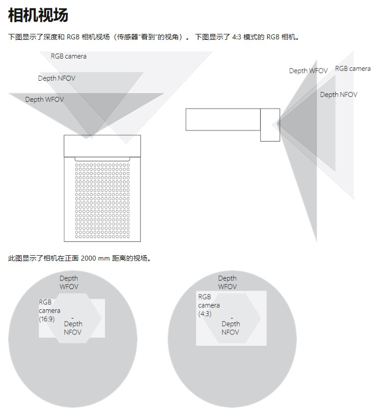
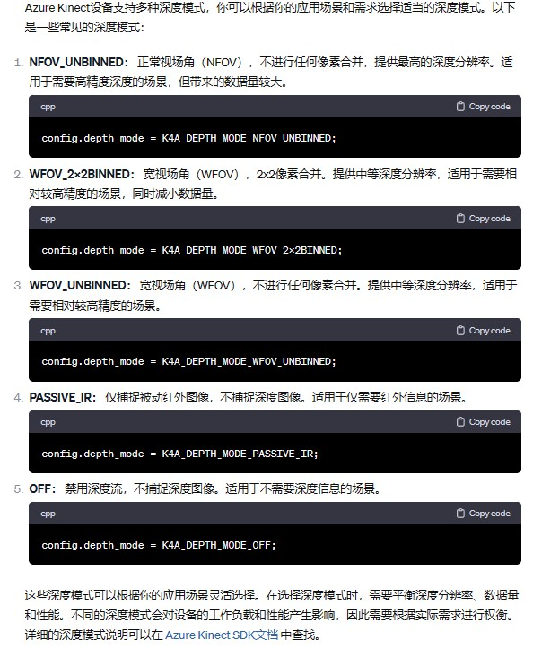

#### Kinect开发

#### 一：资料

SDK中函数说明：https://microsoft.github.io/Azure-Kinect-Sensor-SDK/master/index.html


#### 二：相机参数

##### 1：相机视场



深度相机有两个视场（传感器能看到的视角）:NFOV和WFOV，两个视场能看到的是不一样的，可以观察上面的俯视图和侧视图，RGB和Depth在纵向和横向覆盖的范围是不一样的

##### 2：不同深度模式精度和数据量不一样

这个很重要！！！

##### 

#### 三：代码

##### 1：RGB、IR、深度图显示代码

```
#include <k4a/k4a.h>
#include <opencv2/opencv.hpp>

int main()
{
    k4a_device_t device = nullptr;

    // 打开 Azure Kinect 设备
    // (k4a_device_start_cameras(device, &config): 启动相机，
    通过传递设备和配置信息来启用相机的彩色、深度和红外流。这一步包含启动所有已配置的流，
    包括 RGB、深度和红外。
    if (K4A_FAILED(k4a_device_open(K4A_DEVICE_DEFAULT, &device)))
    {
        printf("无法打开 Azure Kinect 设备！\n");
        return 1;
    }

    // 配置设备启用深度和红外流
    k4a_device_configuration_t config = K4A_DEVICE_CONFIG_INIT_DISABLE_ALL;
    config.camera_fps = K4A_FRAMES_PER_SECOND_15;
    config.depth_mode = K4A_DEPTH_MODE_WFOV_2X2BINNED;  // 设置深度模式
    config.color_format = K4A_IMAGE_FORMAT_COLOR_BGRA32;
    config.color_resolution = K4A_COLOR_RESOLUTION_1080P;

    // 启动相机
    if (K4A_FAILED(k4a_device_start_cameras(device, &config)))
    {
        printf("无法启动相机！\n");
        k4a_device_close(device);
        return 1;
    }

    // 创建 OpenCV 窗口
    cv::namedWindow("Color Image", cv::WINDOW_NORMAL);
    cv::namedWindow("Depth Image", cv::WINDOW_NORMAL);
    cv::namedWindow("IR Image", cv::WINDOW_NORMAL);

    while (true)
    {
        k4a_capture_t capture = nullptr;

        // 捕获一帧
        if (K4A_SUCCEEDED(k4a_device_get_capture(device, &capture, K4A_WAIT_INFINITE)))
        {
            // 获取彩色图像
            k4a_image_t colorImage = k4a_capture_get_color_image(capture);
            if (colorImage != nullptr)
            {
                // 处理并显示彩色图像（使用 OpenCV）
                cv::Mat colorMat(k4a_image_get_height_pixels(colorImage), k4a_image_get_width_pixels(colorImage),
                                 CV_8UC4, (void*)k4a_image_get_buffer(colorImage));
                cv::imshow("Color Image", colorMat);

                k4a_image_release(colorImage);
            }

            // 获取深度图
            k4a_image_t depth_image = k4a_capture_get_depth_image(capture);
            if (depth_image != nullptr)
            {
                // 处理并显示深度图（使用 OpenCV）
                int depth_width = k4a_image_get_width_pixels(depth_image);
                int depth_height = k4a_image_get_height_pixels(depth_image);
                cv::Mat depth_mat(depth_height, depth_width, CV_16U, (void*)k4a_image_get_buffer(depth_image));
                cv::Mat depth_display;
                cv::normalize(depth_mat, depth_display, 0, 255, cv::NORM_MINMAX, CV_8U);
                cv::imshow("Depth Image", depth_display);

                k4a_image_release(depth_image);
            }

            // 获取红外图像
            k4a_image_t ir_image = k4a_capture_get_ir_image(capture);
            if (ir_image != nullptr)
            {
                // 处理并显示红外图像（使用 OpenCV）
                cv::Mat ir_mat(k4a_image_get_height_pixels(ir_image), k4a_image_get_width_pixels(ir_image),
                               CV_16U, (void*)k4a_image_get_buffer(ir_image));
                cv::Mat ir_8bit;
                ir_mat.convertTo(ir_8bit, CV_8U);
                cv::imshow("IR Image", ir_8bit);

                k4a_image_release(ir_image);
            }

            // 释放捕获
            k4a_capture_release(capture);

            // 检查退出键盘按键
            if (cv::waitKey(1) == 27) // ESC键
                break;
        }
    }

    // 停止相机并关闭设备
    k4a_device_stop_cameras(device);
    k4a_device_close(device);

    // 关闭 OpenCV 窗口
    cv::destroyAllWindows();

    return 0;
}

```

###### **（1） Azure Kinect 函数**

```
// 初始化 Azure Kinect 设备配置，禁用所有流
k4a_device_configuration_t config = K4A_DEVICE_CONFIG_INIT_DISABLE_ALL;

// 设置相机帧率为 15 帧/秒
config.camera_fps = K4A_FRAMES_PER_SECOND_15;

// 设置深度模式为 Wide Field of View (WFOV) 2x2 Binned
config.depth_mode = K4A_DEPTH_MODE_WFOV_2X2BINNED;

// 设置彩色图像格式为 BGRA32
config.color_format = K4A_IMAGE_FORMAT_COLOR_BGRA32;

// 设置彩色图像分辨率为 1080p
config.color_resolution = K4A_COLOR_RESOLUTION_1080P;


// 打开 Azure Kinect 设备
k4a_device_open(K4A_DEVICE_DEFAULT, &device);

// 关闭 Azure Kinect 设备
k4a_device_close(device);

// 启动相机
k4a_device_start_cameras(device, &config);

// 获取一帧图像捕获
k4a_device_get_capture(device, &capture, K4A_WAIT_INFINITE);

// 从捕获中获取相应类型的图像
k4a_capture_get_color_image(capture);
k4a_capture_get_depth_image(capture);
k4a_capture_get_ir_image(capture);

// 获取图像的缓冲区指针、宽度和高度
k4a_image_get_buffer(color_image);
k4a_image_get_width_pixels(color_image);
k4a_image_get_height_pixels(color_image);

// 释放图像和捕获的资源
k4a_image_release(color_image);
k4a_capture_release(capture);

// 停止相机
k4a_device_stop_cameras(device);

```

###### **（2） OpenCV 函数**

```
// 创建窗口、显示图像、关闭所有窗口
cv::namedWindow("Color Image", cv::WINDOW_NORMAL);
cv::imshow("Color Image", color_mat);
cv::destroyAllWindows();

// 等待键盘输入
cv::waitKey(30);

// 图像矩阵对象
cv::Mat color_mat(height, width, CV_8UC4, k4a_image_get_buffer(color_image));

// 对图像进行归一化
cv::normalize(depth_mat, depth_display, 0, 255, cv::NORM_MINMAX, CV_8U);

```

###### **（3） 代码逻辑结构**

```
// 打开 Azure Kinect 设备
k4a_device_open(K4A_DEVICE_DEFAULT, &device);

// 配置相机流，启动相机
k4a_device_start_cameras(device, &config);

// 创建 OpenCV 窗口
cv::namedWindow("Color Image", cv::WINDOW_NORMAL);

// 进入循环，获取图像捕获
while (true) {
    // 获取彩色、深度、IR 图像

    // 将图像数据转换为 OpenCV Mat 对象

    // 显示图像

    // 释放资源

    // 检测按键，按下 ESC 键退出循环
}

// 停止相机并关闭设备
k4a_device_stop_cameras(device);
k4a_device_close(device);

// 关闭 OpenCV 窗口
cv::destroyAllWindows();

```


##### 2：实时获取RGB图并显示

```
#include <k4a/k4a.h>
#include <k4arecord/playback.h>
#include <k4arecord/record.h>
#include <opencv2/opencv.hpp>
// 获取RGB图并显示

int main() {
    // 打开 Azure Kinect 设备
    k4a_device_t device = NULL;
    if (K4A_FAILED(k4a_device_open(0, &device))) {
        printf("Failed to open device\n");
        return 1;
    }

    // 配置相机
    k4a_device_configuration_t config = K4A_DEVICE_CONFIG_INIT_DISABLE_ALL;
    config.camera_fps = K4A_FRAMES_PER_SECOND_30;
    config.color_format = K4A_IMAGE_FORMAT_COLOR_BGRA32;
    config.color_resolution = K4A_COLOR_RESOLUTION_1080P;

    // 启动相机
    if (K4A_FAILED(k4a_device_start_cameras(device, &config))) {
        printf("Failed to start cameras\n");
        k4a_device_close(device);
        return 1;
    }

    while (true) {
        // 获取一帧
        k4a_capture_t capture = NULL;
        if (K4A_FAILED(k4a_device_get_capture(device, &capture, K4A_WAIT_INFINITE))) {
            printf("Failed to get capture\n");
            break;
        }

        // 获取彩色图像
        k4a_image_t color_image = k4a_capture_get_color_image(capture);
        if (color_image == NULL) {
            printf("Failed to get color image\n");
            k4a_capture_release(capture);
            break;
        }

        // 获取图像的宽度和高度
        int width = k4a_image_get_width_pixels(color_image);
        int height = k4a_image_get_height_pixels(color_image);

        // 创建 OpenCV 图像
        cv::Mat color_mat(height, width, CV_8UC4, k4a_image_get_buffer(color_image));

        // 显示图像
        cv::imshow("Color Image", color_mat);

        // 释放资源
        k4a_image_release(color_image);
        k4a_capture_release(capture);

        // 检测按键，按ESC键退出循环
        if (cv::waitKey(30) == 27) {
            break;
        }
    }

    // 停止相机
    k4a_device_stop_cameras(device);
    k4a_device_close(device);

    return 0;
}

```


##### 3：实时获取IR相机图并显示

```
#include <k4a/k4a.h>
#include <opencv2/opencv.hpp>
//显示IR相机

int main() {
    // 打开 Azure Kinect 设备
    k4a_device_t device = nullptr;
    if (K4A_FAILED(k4a_device_open(0, &device))) {
        printf("Failed to open device\n");
        return 1;
    }

    // 配置相机
    k4a_device_configuration_t config = K4A_DEVICE_CONFIG_INIT_DISABLE_ALL;
    config.camera_fps = K4A_FRAMES_PER_SECOND_30;
    config.color_format = K4A_IMAGE_FORMAT_COLOR_BGRA32;
    config.color_resolution = K4A_COLOR_RESOLUTION_1080P;
    config.depth_mode = K4A_DEPTH_MODE_WFOV_2X2BINNED;  // 设置深度模式
    //通过改K4A_DEPTH_MODE_WFOV_2X2BINNED这个函数对应不同深度模式，IR图也不同

    // 启动相机
    if (K4A_FAILED(k4a_device_start_cameras(device, &config))) {
        printf("Failed to start cameras\n");
        k4a_device_close(device);
        return 1;
    }

    // 创建 OpenCV 窗口
    cv::namedWindow("IR Image", cv::WINDOW_NORMAL);

    while (true) {
        // 获取一帧
        k4a_capture_t capture = NULL;
        if (K4A_FAILED(k4a_device_get_capture(device, &capture, K4A_WAIT_INFINITE))) {
            printf("Failed to get capture\n");
            break;
        }

        // 获取红外图像
        k4a_image_t ir_image = k4a_capture_get_ir_image(capture);
        if (ir_image == NULL) {
            printf("Failed to get IR image\n");
            k4a_capture_release(capture);
            break;
        }

        // 获取红外图像数据
        cv::Mat ir_mat(k4a_image_get_height_pixels(ir_image), k4a_image_get_width_pixels(ir_image),
                       CV_16U, k4a_image_get_buffer(ir_image));

        // 检查红外图像是否为空
        if (ir_mat.empty()) {
            printf("IR image is empty\n");
            k4a_image_release(ir_image);
            k4a_capture_release(capture);
            break;
        }

        // 转换红外图像为8位灰度图像
        cv::Mat ir_8bit;
        ir_mat.convertTo(ir_8bit, CV_8U);
        cv::imshow("IR Image", ir_8bit);

        // 释放资源
        k4a_image_release(ir_image);
        k4a_capture_release(capture);

        // 检测按键，按ESC键退出循环
        if (cv::waitKey(30) == 27) {
            break;
        }
    }

    // 停止相机
    k4a_device_stop_cameras(device);
    k4a_device_close(device);

    // 关闭 OpenCV 窗口
    cv::destroyAllWindows();

    return 0;
}

```


##### 4：实时获取深度图并显示

```
#include <k4a/k4a.h>
#include <opencv2/opencv.hpp>

int main()
{
    k4a_device_t device = nullptr;

    // 打开 Azure Kinect 设备
    if (K4A_FAILED(k4a_device_open(K4A_DEVICE_DEFAULT, &device)))
    {
        printf("无法打开 Azure Kinect 设备！\n");
        return 1;
    }

    // 配置设备启用深度和红外流
    k4a_device_configuration_t config = K4A_DEVICE_CONFIG_INIT_DISABLE_ALL;
    config.camera_fps = K4A_FRAMES_PER_SECOND_15;
    config.depth_mode = K4A_DEPTH_MODE_WFOV_2X2BINNED;  // 设置深度模式
    config.color_format = K4A_IMAGE_FORMAT_COLOR_BGRA32;
    config.color_resolution = K4A_COLOR_RESOLUTION_1080P;

    // 启动相机
    if (K4A_FAILED(k4a_device_start_cameras(device, &config)))
    {
        printf("无法启动相机！\n");
        k4a_device_close(device);
        return 1;
    }

    // 创建 OpenCV 窗口
    cv::namedWindow("Depth Image", cv::WINDOW_NORMAL);

    while (true)
    {
        k4a_capture_t capture = nullptr;

        // 捕获一帧
        if (K4A_SUCCEEDED(k4a_device_get_capture(device, &capture, K4A_WAIT_INFINITE)))
        {
            // 获取深度图
            k4a_image_t depth_image = k4a_capture_get_depth_image(capture);

            if (depth_image != nullptr)
            {
                // 处理并显示深度图（使用 OpenCV）
                int depth_width = k4a_image_get_width_pixels(depth_image);
                int depth_height = k4a_image_get_height_pixels(depth_image);

                // 将深度图像数据转换为 OpenCV 格式
                cv::Mat depth_mat(depth_height, depth_width, CV_16U, (void*)k4a_image_get_buffer(depth_image));

                // 为显示归一化深度值
                cv::Mat depth_display;
                cv::normalize(depth_mat, depth_display, 0, 255, cv::NORM_MINMAX, CV_8U);

                // 显示深度图
                cv::imshow("Depth Image", depth_display);
                
                // 释放深度图
                k4a_image_release(depth_image);
            }

            // 释放捕获
            k4a_capture_release(capture);

            // 检查退出键盘按键
            if (cv::waitKey(1) == 27) // ESC键
                break;
        }
    }

    // 停止相机并关闭设备
    k4a_device_stop_cameras(device);
    k4a_device_close(device);

    return 0;
}

```


##### 5：函数代码解释

在Azure Kinect中，如果需要红外图像，必须在相机配置中明确启用红外流，否则设备不会产生相应的数据。

在示例代码中，添加了以下配置以启用红外流：

```
config.depth_mode = K4A_DEPTH_MODE_WFOV_2X2BINNED;  // 设置深度模式
```

这确保了在启动相机时，红外流会随着深度模式一同启用。在图像获取的部分，

使用 `k4a_capture_get_ir_image` 获取红外图像。然后将获取到的红外图像转换并显示

**注意：**一定要启动红外流、深度流才有图像显示，否则只是连接了相机但是没有图像数据


##### 6：备注

Opencv出来16位图时候会有问题，所以一般转为8位


#### 四：matlab标定参数


cameraParams.IntrinsicMatrix  内参

cameraParams.ExtrinsicMatrix 外参

外参由以下两个组成：R_ir2rgb  旋转矩阵，T_ir2rgb  平移向量

内参矩阵：
   fx         0       0

skew      fy      0

   cx        cy      1

注：skew是倾斜参数

#### 六：开发进度和备注

##### 1：开发预期功能

1）：开发一个读取kinect相机数据的界面——用于读取不同模式的RGB、IR、Depth数据

2）：RGBD数据融合（实时显示）——涉及深度图和彩色图的对齐问题，目前尝试了一些代码还没有跑通

​			如果使用标定数据的话，需要读取matlab的标定结果，目前是手动填写参数到txt文件然后再读取

​			网上有opencv读取matlab导出的内外参数的xml文件，但是还没有尝试

3）：标定采用Matlab的话比较简单，也可以采用opencv的标定程序（还没试过），后续再把标定过程看看能不能封装到软件里

4）：点云数据的获取、实时显示、保存

5）：


1：E:\vs2022_progarms\kinect_kaifa 里面有两个文件夹，baocun和RGB_IR_DEPTH

baocun：

（1）baocun 里面是只捕捉一帧的照片（IR RGB Depth）和点云（用Matlab查看ply文件）

（2）baocun里面有关于配准的代码，和转换为点云的代码，后续搞明白并改为实时获取，并加入界面设计

RGB_IR_DEPTH：

里面可以实时显示RGB IR DEPTH数据，但是没有其他处理

联合上面两个代码，做出实时获取数据（保存点云），并增加保存功能


2：viewer里面可以实时查看点云数据，参考这部分代码弄懂


这段代码是使用C++标准库中的文件输出流（`std::ofstream`）创建一个文件并写入文本数据。让我为你解释一下：

1. `std::ofstream ofs(file_name);`: 这行代码创建了一个名为 `ofs` 的文件输出流对象，它与指定的文件名 `file_name` 相关联。如果文件不存在，将会创建一个新文件；如果文件已存在，它将被截断（即清空文件内容）。

2. `ofs << "ply" << std::endl;`: 这行代码将字符串 "ply" 写入文件流 `ofs`。`<<` 运算符用于将数据插入流中。`std::endl` 代表插入一个换行符，并刷新缓冲区。这一行的效果是将 "ply" 字符串写入文件并换行。

3. `ofs << "format ascii 1.0" << std::endl;`: 同上，将 "format ascii 1.0" 字符串写入文件并换行。

4. `ofs << "element vertex " << point_count << std::endl;`: 这一行将 "element vertex " 字符串和变量 `point_count` 的值写入文件，并在末尾换行。

5. 后续的几行类似，将字符串和变量写入文件并换行，用于定义PLY文件头部信息。

6. `ofs.close();`: 最后，这行代码关闭文件输出流。在C++中，当流被关闭时，它将释放与文件相关的资源。

这样，这段代码的作用是创建一个以ASCII格式存储点云数据的PLY文件，并在文件开头定义了PLY文件的头部信息。